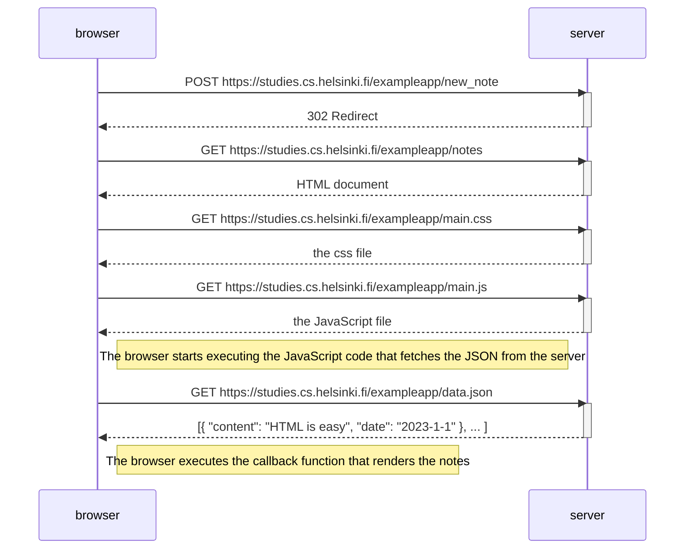
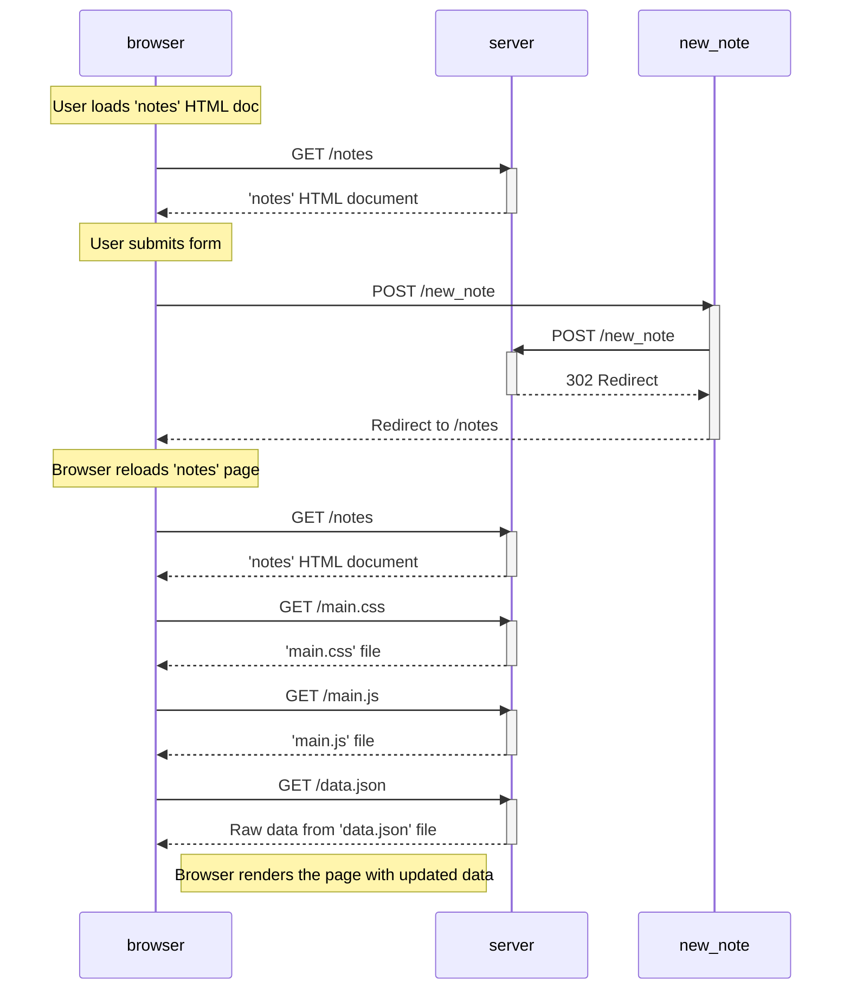

```mermaid
sequenceDiagram
    participant browser
    participant server

    browser->>server: POST https://studies.cs.helsinki.fi/exampleapp/new_note
    activate server
    server-->>browser: 302 Redirect
    deactivate server

    browser->>server: GET https://studies.cs.helsinki.fi/exampleapp/notes
    activate server
    server-->>browser: HTML document
    deactivate server

    browser->>server: GET https://studies.cs.helsinki.fi/exampleapp/main.css
    activate server
    server-->>browser: the css file
    deactivate server

    browser->>server: GET https://studies.cs.helsinki.fi/exampleapp/main.js
    activate server
    server-->>browser: the JavaScript file
    deactivate server

    Note right of browser: The browser starts executing the JavaScript code that fetches the JSON from the server

    browser->>server: GET https://studies.cs.helsinki.fi/exampleapp/data.json
    activate server
    server-->>browser: [{ "content": "HTML is easy", "date": "2023-1-1" }, ... ]
    deactivate server

    Note right of browser: The browser executes the callback function that renders the notes
```

### Other:

```mermaid
sequenceDiagram
    participant browser
    participant server
    participant new_note

    Note over browser: User loads 'notes' HTML doc
    browser->>server: GET /notes
    activate server
    server-->>browser: 'notes' HTML document
    deactivate server

    Note over browser: User submits form
    browser->>new_note: POST /new_note
    activate new_note
    new_note->>server: POST /new_note
    activate server
    server-->>new_note: 302 Redirect
    deactivate server
    new_note-->>browser: Redirect to /notes
    deactivate new_note

    Note over browser: Browser reloads 'notes' page
    browser->>server: GET /notes
    activate server
    server-->>browser: 'notes' HTML document
    deactivate server

    browser->>server: GET /main.css
    activate server
    server-->>browser: 'main.css' file
    deactivate server

    browser->>server: GET /main.js
    activate server
    server-->>browser: 'main.js' file
    deactivate server

    browser->>server: GET /data.json
    activate server
    server-->>browser: Raw data from 'data.json' file
    deactivate server

    Note right of browser: Browser renders the page with updated data
```